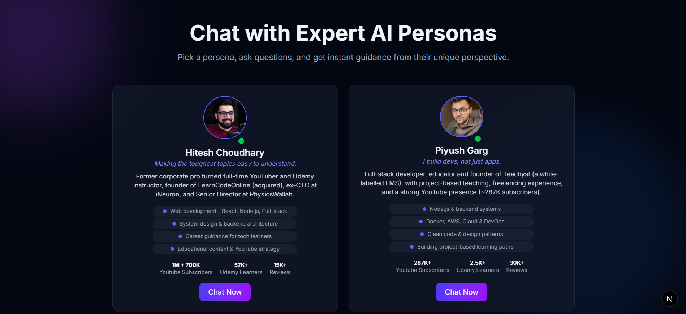

# 📦 Next.js Persona Chat — README

🚀 **Modern AI-powered chat app** built with Next.js App Router, TailwindCSS, Framer Motion animations, and optimized performance features.

---

## 📑 Table of Contents

1. Getting Started
2. Editing & Structure
3. Scripts & Commands
4. Environment Variables
5. Deployment
6. Features & Integrations
7. Contributing
8. License

---

## 🏁 Getting Started

**Clone the repository**

```
git clone <your-repository-url>
cd <your-project-folder>
```

**Install dependencies**

```
npm install   # or yarn install / pnpm install / bun install
```

**Run development server**

```
npm run dev   # or yarn dev / pnpm dev / bun dev
```

**Open in browser**

```
http://localhost:3000
```

Hot Reload will automatically update changes.

---

## ✏️ Editing & Structure

- Main entry: `app/page.js` or `app/page.tsx`
- App Router is enabled: layouts, nested routes, server/client components
- Fonts optimized with `next/font` (Inter by default)

---

## 📜 Scripts & Commands

| Command | Description                  |
| ------- | ---------------------------- |
| `dev`   | Start development server     |
| `build` | Build production assets      |
| `start` | Run production build locally |
| `lint`  | Run ESLint static analysis   |

---

## 🔑 Environment Variables

Create a `.env.local` file in the root:

```
GEMINI_API_KEY=<your-api-key-here>
```

---

## ☁️ Deployment

Deploy to **Vercel** for instant hosting.
For alternatives, see [Next.js Deployment Docs](https://nextjs.org/docs/deployment).

---

## 🛠 Features & Integrations

- ✅ Next.js App Router
- ✅ TailwindCSS utility-first styling
- ✅ Framer Motion page animations
- ✅ ESLint setup
- ✅ API Routes (route.js)
- ✅ Image Optimization with `<Image />`
- ✅ Hot Module Replacement (HMR)

---

## 🤝 Contributing

Pull requests are welcome!
Fork → Create Feature Branch → Commit → Push → Open PR.

---

## 📄 License

MIT License — free for personal and commercial use.

---

## 🖼 Demo Preview



---

## 🏗 Tech Stack Badges


